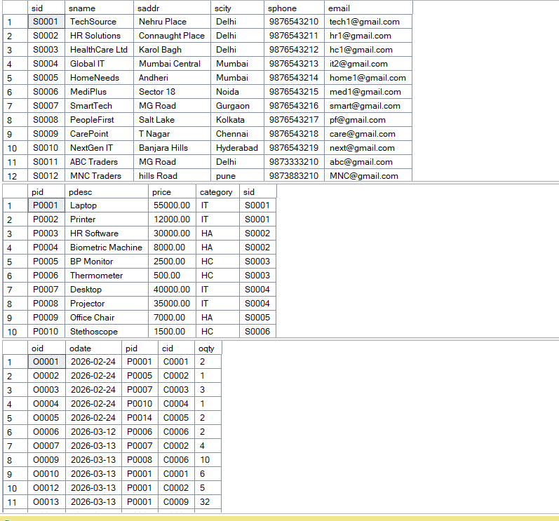
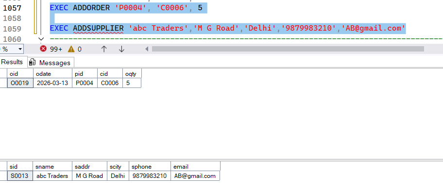
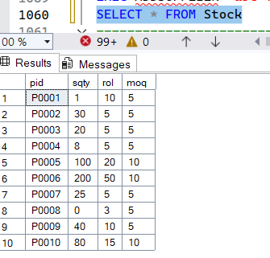
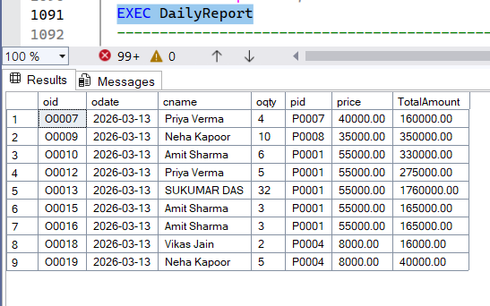

# sql-inventory-management-system
Inventory Management System using SQL Server with stored procedures, triggers, and automated stock management.

SQL Inventory Management System

This project demonstrates an inventory management database built using SQL Server.

Features
• Auto ID generation using functions and sequences
• Stored procedures for managing suppliers, products, customers, and orders
• Triggers for automatic stock updates
• Automatic purchase order generation when stock falls below reorder level
• Reporting procedures for business insights

Technologies
SQL Server
T-SQL
Stored Procedures
Triggers
Sequences

### Tables Created

### Stored Procedure Execution

### Stock Update Trigger

### Daily Report

